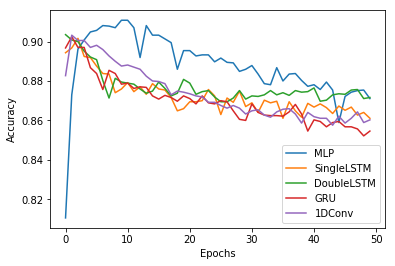
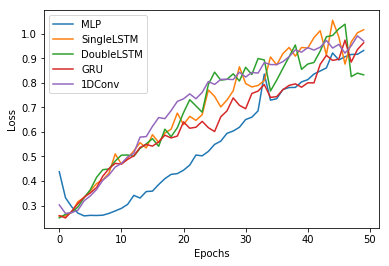
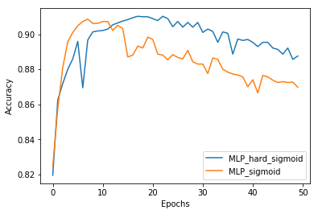
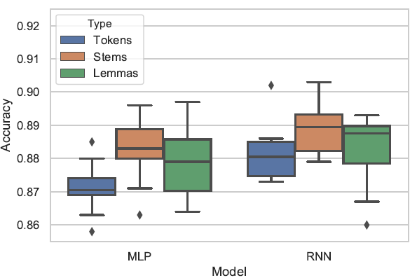
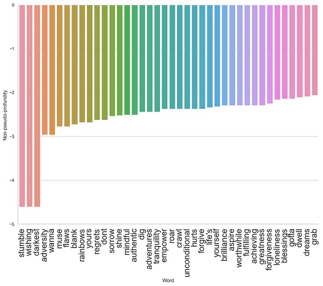
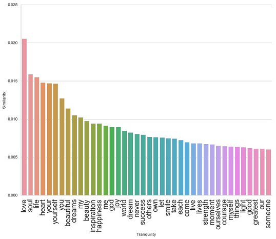
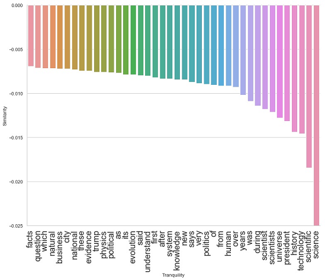
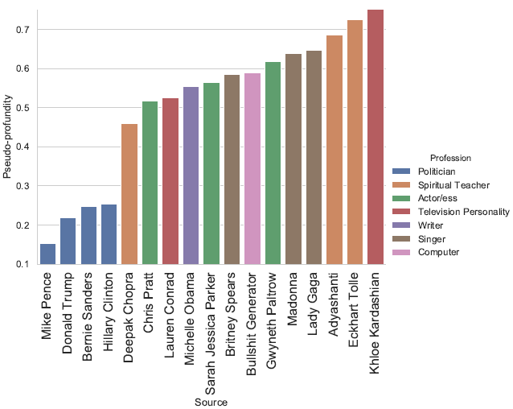

# Pseudo-profundity Detection

## In this repository

This is a text classification task predicting the presence of pseudo-profundity. The older classifiers presented below are now removed and newer methods will continue to be updated in the now one compact notebook. An introduction to pseudo-profundity and former findings will follow. In the current notebook are five models: **MLP, SingleLSTM, DoubleLSTM, GRU, 1DConv**. Their validation accuracies and losses are shown as below as well as individual predictions on two example sentences where 1 indicates the absence and 0 the presence of pseudo-profundity.

              "You are basic!" "Live, laugh, love!"
      MLP    0.82606065        0.00919458
      1LSTM  0.998755          0.10788591
      2LSTM  0.7130968         0.36986926
      GRU    0.83411187        0.08223568
      1DConv 0.9997211         0.4741875
      
### Revisions on the MLP model

Since overfitting is observed, we can make some changes based on the MLP model. We reduce the hidden layer size to 8 and input maximum length to 100, and in addition, we want to compare if the activation function for the final single output will improve when changed to a hard sigmoid function. The results are shown below. Therefore, the metadata and trained vectors are updated accordingly in tsv files. The model summary is decribed below. With an additional 81 parameters, its accuracy is fairly satisfactory.

    _________________________________________________________________
    Layer (type)                 Output Shape              Param #  
    _________________________________________________________________
    embedding (Embedding)        (None, 100, 8)            80000    
    global_average_pooling1d (Gl (None, 8)                 0        
    dense (Dense)                (None, 8)                 72       
    dense_1 (Dense)              (None, 1)                 9        

    Total params: 80,081
    Trainable params: 80,081
    Non-trainable params: 0
    _________________________________________________________________

### Saved Model & Tokenizer
To build a command line version for use of the classifier, we can save the tokenizer and a model as shown in the notebook with the 1DConv model. Execute Predict_conv.py while placing tokenizer.json and 1DConv_model.h5 in the same directory, and enjoy detecting pseudo-profundity!

## Definitions:
Pseudo-profound quotes/texts are labelled as **vacuous** (0) and as **mundane** (1) otherwise:

  - *MUNDANE*: “If there is no wall, there is no deal!”
  - *VACUOUS*: “A wet man doesn’t fear the rain.”

- Psycology:  
  - **pseudo-profound quotes**:
  “consists of seemingly impressive assertions that are presented as true and meaningful but
  are actually vacuous (Pennycook et al., 2015, p. 549)”
- Philosophy & Literature:
  - **humbug** (Black, 1982):
  “deceptive misrepresentation, short of lying, especially by pretentious
  word or deed, of somebody’s own thoughts, feelings, or attitudes (Max Black)”
  - **kitsch** (Botz-Bornstein, 2015, 2017)
  - **bullshit** (Frankfurt, 2009)
  
## Pseudo-profound quote examples

Created by *Online Quote Poster Maker* (https://quotescover.com/) 
  
## Data

- Instagram Captions
- Wikiquotes
- Goodreads

## Inputs

- tokens (using TweetTokenizer)
- stems (using Snowball stemer)
- lemmas (using WordNet lemmatizer)

## Models

- Multilayer Perceptrons/MLP (old notebook removed)
- Recurrent Neural Networks/RNN (old notebook removed)

## Results

The RNN models outperform the MLP counterparts to a negligible extent in terms of accuracy. In addition, morphological normalizations, stemming in particular, seem to be effective in improving the performances. That is, stems alone contain the major (non-)pseudo-profound senses. Affixes, derivational and inflectional alike, are not as informative.

## Top 40 Vacuous Words (least mundane)

## Word Similarity

The most and least similar words to the buzzword *tranquility* in the space of pseudo-profundity

## Detection

Below is the predicted rates of pseudo-profundity based on 16 celebrities' public Instagram captions and 1 computer-generated source by *Bullshit Generator* (http://sebpearce.com/bullshit/). The detection is done based on the training on the entire dataset with the old *MLP + Stemming* model (this means that we also need to stem the inputs for detection). The bullshit quotes aren't as pseudo-profound as expected because of its absence in our training data.

